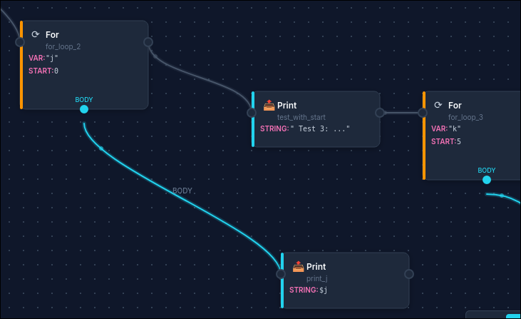

# LexFlow Web

A visual workflow editor and execution environment for LexFlow. Build workflows by dragging and connecting nodes, or write YAML/JSON directly in the integrated code editor.



## Features

- **Visual Node Editor**: Drag-and-drop workflow creation with Scratch-inspired blocks
- **Live Code Sync**: Changes in the visual editor sync with YAML/JSON code and vice-versa
- **Real-time Execution**: Run workflows with streaming output via WebSocket
- **Client-side Parsing**: Workflow visualization happens entirely in the browser
- **Customizable Backend**: Swap the execution backend or run fully offline

## Quick Start

### Prerequisites

- Python 3.10+
- Node.js 18+ (for frontend development)
- [uv](https://docs.astral.sh/uv/) package manager

### Installation

```bash
# Install dependencies (from monorepo root)
uv sync --all-extras

# Start the server
uv run lexflow-web
```

Open http://localhost:8000 in your browser.

### Running in Development Mode

For frontend development with hot reload:

```bash
# Terminal 1: Start backend
uv run lexflow-web --reload

# Terminal 2: Start frontend dev server
cd lexflow-web/frontend
npm install
npm run dev
```

The frontend dev server runs on http://localhost:5173 and proxies API requests to the backend.

## Documentation

- **[Getting Started](docs/GETTING_STARTED.md)** - Installation and setup guide
- **[User Guide](docs/USER_GUIDE.md)** - How to use the visual editor
- **[Customization](docs/CUSTOMIZATION.md)** - Custom backends and providers

## Project Structure

```
lexflow-web/
├── frontend/              # The visual editor (runs in your browser)
│   ├── src/
│   │   ├── components/    # UI pieces (canvas, editor, palette, etc.)
│   │   ├── hooks/         # Reusable behaviors
│   │   ├── providers/     # Server connection
│   │   ├── services/      # Workflow processing
│   │   └── store/         # App state
│   └── ...
└── src/lexflow_web/       # The server (runs workflows)
    ├── api.py             # Handles requests from the editor
    ├── websocket.py       # Sends live output during execution
    └── app.py             # Starts the server
```

### Key Design Decisions

1. **Fast Visualization**: Workflows are displayed instantly in the browser without waiting for the server.

2. **Flexible Backend**: You can connect to different servers or run certain features offline. See [Customization](docs/CUSTOMIZATION.md) for details.

3. **Dual Editing Modes**: Edit workflows visually (drag-and-drop) or as code (YAML/JSON). Both stay in sync.

## API Endpoints

These are the server endpoints that power the editor:

| Endpoint | What it does |
|----------|--------------|
| `/api/opcodes` | Lists all available operations |
| `/api/examples` | Lists example workflows |
| `/api/examples/{path}` | Gets an example's content |
| `/api/execute` | Runs a workflow |
| `/api/validate` | Checks if a workflow is valid |
| `/ws/execute` | Runs a workflow with live output |

## Configuration

For advanced setups (connecting to a remote server, etc.), you can set these environment variables:

| Variable | Default | Description |
|----------|---------|-------------|
| `VITE_API_BASE_URL` | `/api` | Server address for the backend |
| `VITE_WS_URL` | (auto) | Server address for live output (usually auto-detected) |

## Contributing

1. Fork the repository
2. Create a feature branch
3. Make your changes
4. Run tests: `npm test` (frontend), `pytest` (backend)
5. Submit a pull request

## License

MIT
